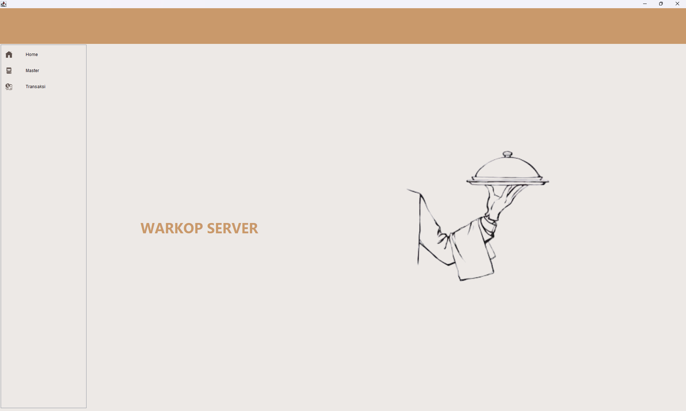

# ☕ KasirCafe-App

Aplikasi kasir cafe berbasis Java Swing dan MySQL untuk manajemen transaksi, produk, dan stok barang.

Project ini dibuat sebagai tugas Uprak untuk Pak Dwi dengan tujuan membantu proses pencatatan produk dan keuangan cafe agar lebih cepat dan efisien.


---

## ✨ Features

- Login multi user
- CRUD produk
- CRUD kategori
- Sistem transaksi kasir
- Pencarian produk
- Manajemen stok

---

## 🛠 Tech Stack

- Java Swing
- MySQL
- JDBC
- NetBeans

---

## 🧠 Database Design

Table yang digunakan:

- users
- transaksi
- detail_transaksi
- menu_produk
- kategori

---

## ⚙ Installation

1. Clone repository

```bash
git clone https://github.com/username/KasirCafe-App.git
```

2. Import database ke MySQL

```sql
kasircafe.sql
```

3. Open project menggunakan NetBeans

4. Run project

---

## 🗂 Folder Structure

```bash
src/
├── config/
├── model/
├── service/
├── view/
├── custom/
└── main/
```

---

## 📸 Preview

Tambahkan screenshot aplikasi di sini.

```md


```

---

## 📄 License

Project ini dibuat untuk keperluan pembelajaran dan tugas sekolah.
